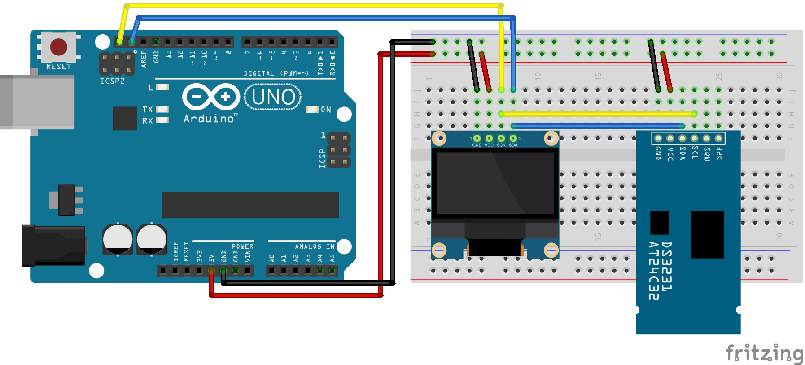

# Arduino Real Time Oled Clock
Project explains how to connect DS3231 Real Time Clock and SSD1306 OLED display to Arduino to make simple digital clock for projects like home weather station.

Project depends on external Arduino libraries
* [Adafruit GFX](https://github.com/adafruit/Adafruit-GFX-Library)
* [Adafruit_SSD1306](https://github.com/adafruit/Adafruit_SSD1306)
* [RTClib](https://github.com/adafruit/RTClib)

## Pin connection

| Arduino       | SSD1306/DS3231 |
|:-------------:|:--------------:|
| 5V            | 5V             |
| GND           | GND            |
| SCL           | SCL            |
| SDA           | SDA            |

Following picture how RTC and OLED should be connected with Arduino.

## License
This project is licensed under the MIT License - see the [LICENSE.md](LICENSE.md) file for details.
