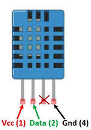

# DHT11 readings
Project explains how to connect DHT11 temperature and humidity sensor to microcontrollers.

Project depends on external Arduino libraries
* [DHT sensor library](https://github.com/adafruit/DHT-sensor-library)

## Hardware components
* Microcontroller (Arduino Uno, WeMos D1 Mini etc.)
* DHT11 temperature and humidity sensor
* 10 kOhm pull-up resistor

## Pin connection

DHT11 pinouts are described as follows

A 10 kOhm pull-up resistor is required to keep the data line high and in order to enable the communication between the sensor and the microcontroller.

| Microcontroller | DHT11    |
|:---------------:|:--------|
| 5V              | (1) Vcc  |
| D2              | (2) Data |
|   -             | (3) -    |
| GND             | (4) GND  |

Circuit examples are provided for following microcontrollers:
* Arduino Uno
* WeMos D1 Mini
* WeMos D1 R1
